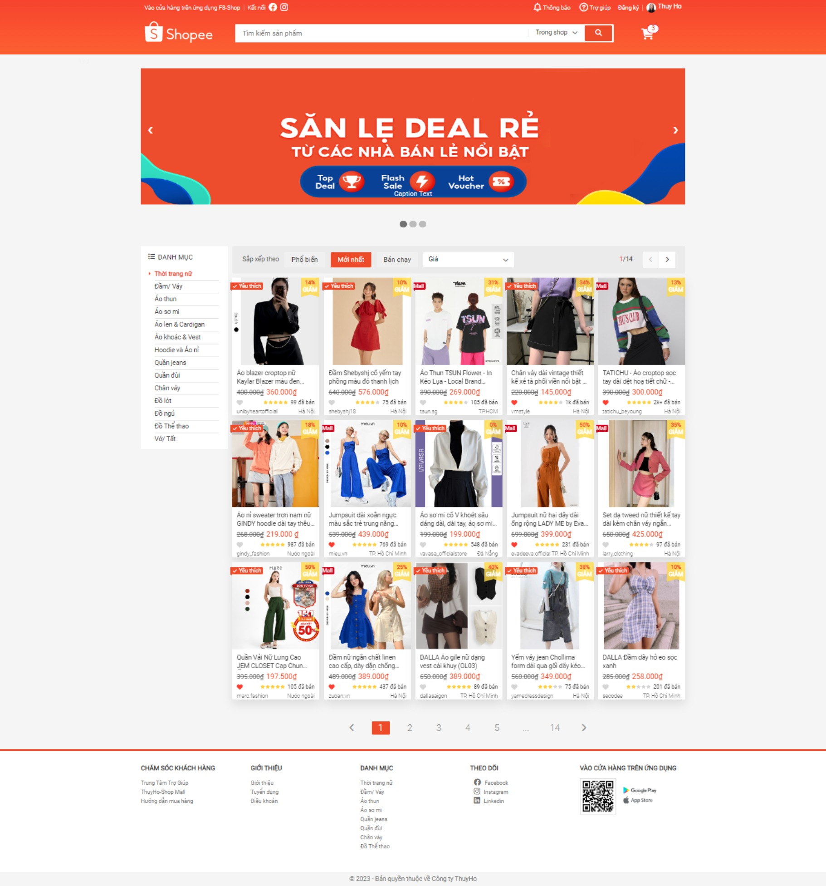

# Web-TShopee
## Build Web TShopee
👉 Xem trang web mẫu tại đây: https://f8ubuntu.online/ 🎉🎉
> [MyReport](https://docs.google.com/document/d/17Dmw9fUJfpM4qIYk1pLFmWJRaSrR5O0e/edit#)

## TShopee

### Steps:
***
* _Dựng base source_
* Reset CSS
* Dựng base CSS
* Dựng khung web
* Navbar CSS
* Nhúng Font-Icons
* Icons CSS
* Header notification CSS
* Base modal
* Dựng khung form đăng ký
* CSS form đăng ký
* CSS form đăng nhập 
* Javascript form đăng ký
* Modal animation
* Dựng khung phần tìm kiếm
* Header tìm kiếm CSS
* Lịch sử tìm kiếm CSS
* Header giỏ hàng trống CSS
* Header cart badge
* Header cart - List products
* Header user info
* Header fix UI bugs
* Danh mục: Dựng khung
* Dựng khung: Sắp xếp sản phẩm
* CSS: Sắp xếp sản phẩm
* Dựng khung sản phẩm
* CSS Sản phẩm: Name-Price-Like-Star Product
* Sản phẩm: CSS nhãn yêu thích
* Fix UI bug - Catagory/Product
* Pagination UI
* Dựng khung Footer
* CSS Footer
***
### Link:
> * Reset CSS: https://cdnjs.com/libraries/normalize
> * Font Roboto: https://fonts.google.com/specimen/Roboto
> * Font-Icons: https://fontawesome.com/search
> * Format code: https://webformatter.com/html
> * My Certification: https://drive.google.com/file/d/1AvroCIm7wPev3Tt14u1EQmBJpPrCE80T/view?usp=sharing