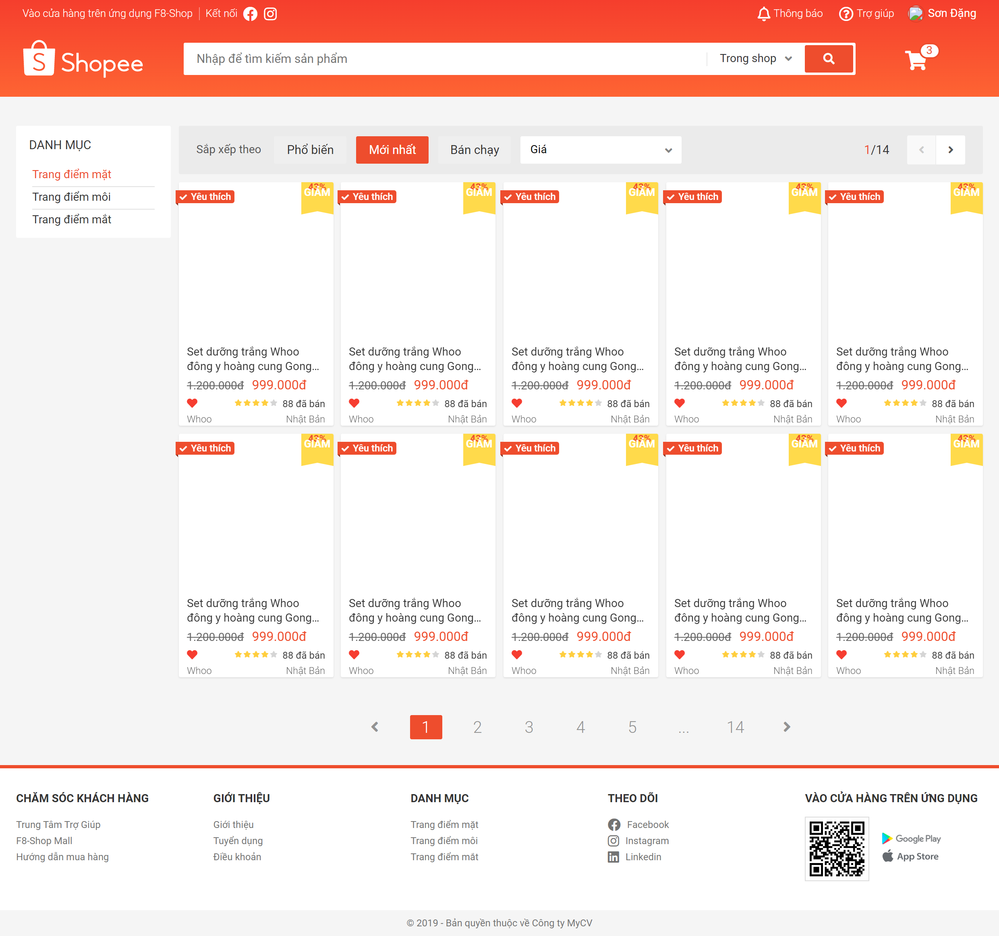

# Web-Shopee
## Build Web Shopee
👉 Xem trang web mẫu tại đây: https://f8ubuntu.online/ 🎉🎉
> [MyReport](https://docs.google.com/document/d/17Dmw9fUJfpM4qIYk1pLFmWJRaSrR5O0e/edit#)

### Steps:
***
* _Dựng base source_
* Reset CSS
* _Dựng base CSS_
* _Dựng khung web_
* Navbar CSS
* Nhúng Font-Icons
* Icons CSS
* Header notification CSS
* _Base modal_
* _Dựng khung form đăng ký_
* CSS form đăng ký
***
## Sample

### Link:
> * Reset CSS: https://cdnjs.com/libraries/normalize
> * Font Roboto: https://fonts.google.com/specimen/Roboto
> * Font-Icons: https://fontawesome.com/search
